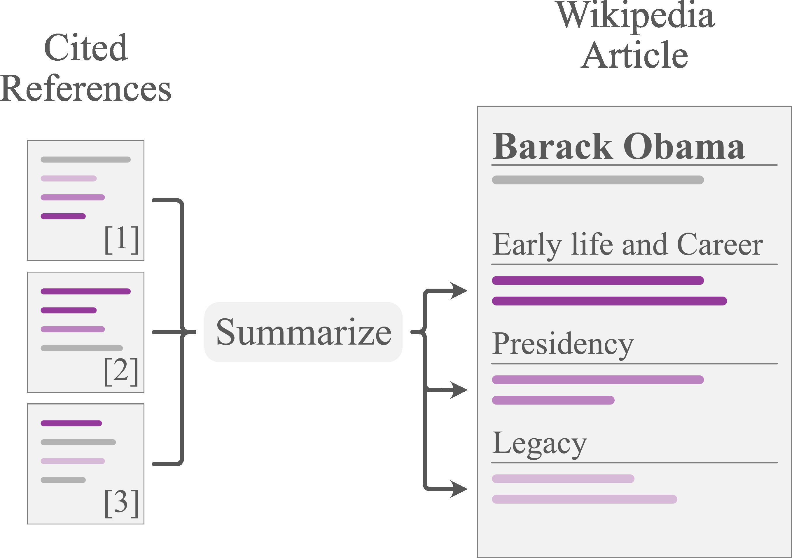

# WikiAsp: A Dataset for Multi-domain Aspect-based Summarization

This repository contains the dataset from the paper "[WikiAsp: A Dataset for Multi-domain Aspect-based Summarization](http://arxiv.org/abs/2011.07832)".

WikiAsp is a multi-domain, aspect-based summarization dataset in the encyclopedic domain.
In this task, models are asked to summarize *cited reference documents* of a Wikipedia article into aspect-based summaries.
Each of the 20 domains include 10 domain-specific pre-defined aspects.

<div align="center"></div>

## Dataset 

### Download

WikiAsp is a available via 20 zipped archives, each of which corresponds to a domain.
**More than 28GB of storage space** is necessary to download and store all the domains (unzipped).
The following command will download all of them and extract archives:

```sh
./scripts/download_and_extract_all.sh /path/to/save_directory
```
Alternatively, one can individually download an archive for each domain from the table below. (Note: left-clicking will not prompt downloading dialogue. Open the link in a new tab, or save from the context menu on your OS, or use `wget`.)

<table>
    <thead>
        <tr>
            <th>Domain</th>
            <th>Link</th>
            <th>Size (unzipped)</th>
        </tr>
    </thead>
    <tbody>
        <tr>
            <td><a href="http://mappings.dbpedia.org/index.php/OntologyClass:Album">Album</a></td>
            <td><a href="http://phontron.com/download/wikiasp/Album.tar.bz2" target="_blank">Download</a></td>
            <td>2.3GB</td>
        </tr>
        <tr>
            <td><a href="http://mappings.dbpedia.org/index.php/OntologyClass:Animal">Animal</a></td>
            <td><a href="http://phontron.com/download/wikiasp/Animal.tar.bz2" target="_blank">Download</a></td>
            <td>589MB</td>
        </tr>
        <tr>
            <td><a href="http://mappings.dbpedia.org/index.php/OntologyClass:Artist">Artist</a></td>
            <td><a href="http://phontron.com/download/wikiasp/Artist.tar.bz2" target="_blank">Download</a></td>
            <td>2.2GB</td>
        </tr>
        <tr>
            <td><a href="http://mappings.dbpedia.org/index.php/OntologyClass:Building">Building</a></td>
            <td><a href="http://phontron.com/download/wikiasp/Building.tar.bz2" target="_blank">Download</a></td>
            <td>1.3GB</td>
        </tr>
        <tr>
            <td><a href="http://mappings.dbpedia.org/index.php/OntologyClass:Company">Company</a></td>
            <td><a href="http://phontron.com/download/wikiasp/Company.tar.bz2" target="_blank">Download</a></td>
            <td>1.9GB</td>
        </tr>
        <tr>
            <td><a href="http://mappings.dbpedia.org/index.php/OntologyClass:EducationalInstitution">EducationalInstitution</a></td>
            <td><a href="http://phontron.com/download/wikiasp/EducationalInstitution.tar.bz2" target="_blank">Download</a></td>
            <td>1.9GB</td>
        </tr>
        <tr>
            <td><a href="http://mappings.dbpedia.org/index.php/OntologyClass:Event">Event</a></td>
            <td><a href="http://phontron.com/download/wikiasp/Event.tar.bz2" target="_blank">Download</a></td>
            <td>900MB</td>
        </tr>
        <tr>
            <td><a href="http://mappings.dbpedia.org/index.php/OntologyClass:Film">Film</a></td>
            <td><a href="http://phontron.com/download/wikiasp/Film.tar.bz2" target="_blank">Download</a></td>
            <td>2.8GB</td>
        </tr>
        <tr>
            <td><a href="http://mappings.dbpedia.org/index.php/OntologyClass:Group">Group</a></td>
            <td><a href="http://phontron.com/download/wikiasp/Group.tar.bz2" target="_blank">Download</a></td>
            <td>1.2GB</td>
        </tr>
        <tr>
            <td><a href="http://mappings.dbpedia.org/index.php/OntologyClass:HistoricPlace">HistoricPlace</a></td>
            <td><a href="http://phontron.com/download/wikiasp/HistoricPlace.tar.bz2" target="_blank">Download</a></td>
            <td>303MB</td>
        </tr>
        <tr>
            <td><a href="http://mappings.dbpedia.org/index.php/OntologyClass:Infrastructure">Infrastructure</a></td>
            <td><a href="http://phontron.com/download/wikiasp/Infrastructure.tar.bz2" target="_blank">Download</a></td>
            <td>1.3GB</td>
        </tr>
        <tr>
            <td><a href="http://mappings.dbpedia.org/index.php/OntologyClass:MeanOfTransportation">MeanOfTransportation</a></td>
            <td><a href="http://phontron.com/download/wikiasp/MeanOfTransportation.tar.bz2" target="_blank">Download</a></td>
            <td>792MB</td>
        </tr>
        <tr>
            <td><a href="http://mappings.dbpedia.org/index.php/OntologyClass:OfficeHolder">OfficeHolder</a></td>
            <td><a href="http://phontron.com/download/wikiasp/OfficeHolder.tar.bz2" target="_blank">Download</a></td>
            <td>2.0GB</td>
        </tr>
        <tr>
            <td><a href="http://mappings.dbpedia.org/index.php/OntologyClass:Plant">Plant</a></td>
            <td><a href="http://phontron.com/download/wikiasp/Plant.tar.bz2" target="_blank">Download</a></td>
            <td>286MB</td>
        </tr>
        <tr>
            <td><a href="http://mappings.dbpedia.org/index.php/OntologyClass:Single">Single</a></td>
            <td><a href="http://phontron.com/download/wikiasp/Single.tar.bz2" target="_blank">Download</a></td>
            <td>1.5GB</td>
        </tr>
        <tr>
            <td><a href="http://mappings.dbpedia.org/index.php/OntologyClass:SoccerPlayer">SoccerPlayer</a></td>
            <td><a href="http://phontron.com/download/wikiasp/SoccerPlayer.tar.bz2" target="_blank">Download</a></td>
            <td>721MB</td>
        </tr>
        <tr>
            <td><a href="http://mappings.dbpedia.org/index.php/OntologyClass:Software">Software</a></td>
            <td><a href="http://phontron.com/download/wikiasp/Software.tar.bz2" target="_blank">Download</a></td>
            <td>1.3GB</td>
        </tr>
        <tr>
            <td><a href="http://mappings.dbpedia.org/index.php/OntologyClass:TelevisionShow">TelevisionShow</a></td>
            <td><a href="http://phontron.com/download/wikiasp/TelevisionShow.tar.bz2" target="_blank">Download</a></td>
            <td>1.1GB</td>
        </tr>
        <tr>
            <td><a href="http://mappings.dbpedia.org/index.php/OntologyClass:Town">Town</a></td>
            <td><a href="http://phontron.com/download/wikiasp/Town.tar.bz2" target="_blank">Download</a></td>
            <td>932MB</td>
        </tr>
        <tr>
            <td><a href="http://mappings.dbpedia.org/index.php/OntologyClass:WrittenWork">WrittenWork</a></td>
            <td><a href="http://phontron.com/download/wikiasp/WrittenWork.tar.bz2" target="_blank">Download</a></td>
            <td>1.8GB</td>
        </tr>
    </tbody>
</table>

### Format

Each domain includes three files `{train,valid,test}.jsonl`, and each line represents one instance in JSON format. 
Each instance forms the following structure:

```json
{
    "exid": "train-1-1",
    "input": [  
        "tokenized and uncased sentence_1 from document_1",
        "tokenized and uncased sentence_2 from document_1",
        "...",
        "tokenized and uncased sentence_i from document_j",
        "..."
    ],
    "targets": [ 
        ["a_1", "tokenized and uncased aspect-based summary for a_1"],
        ["a_2", "tokenized and uncased aspect-based summary for a_2"],
        "..."
    ]
}
```
where,
* exid: `str`
* input: `List[str]`
* targets: `List[Tuple[str,str]]`

Here, `input` is the cited references and consists of tokenized sentences (with NLTK).
The `targets` key points to a list of aspect-based summaries, where each element is a pair of a) the target aspect  and b) the aspect-based summary.

Inheriting from the base [corpus](https://github.com/tensorflow/tensor2tensor/tree/master/tensor2tensor/data_generators/wikisum), this dataset exhibits the following characteristics:

* Cited references are composed of multiple documents, but the document boundaries are lost, thus expressed simply in terms of list of sentences.
* Sentences in the cited references (`input`) are tokenized using NLTK.
* The number of target summaries for each instance varies.


## Citation
If you use the dataset, please consider citing with
```
@article{hayashi20tacl,
    title = {WikiAsp: A Dataset for Multi-domain Aspect-based Summarization},
    author = {Hiroaki Hayashi and Prashant Budania and Peng Wang and Chris Ackerson and Raj Neervannan and Graham Neubig},
    journal = {Transactions of the Association for Computational Linguistics (TACL)},
    month = {},
    url = {https://arxiv.org/abs/2011.07832},
    year = {2020}
}
```

## LICENSE

<a rel="license" href="http://creativecommons.org/licenses/by-sa/4.0/"></a><br />This work is licensed under a <a rel="license" href="http://creativecommons.org/licenses/by-sa/4.0/">Creative Commons Attribution-ShareAlike 4.0 International License</a>.
